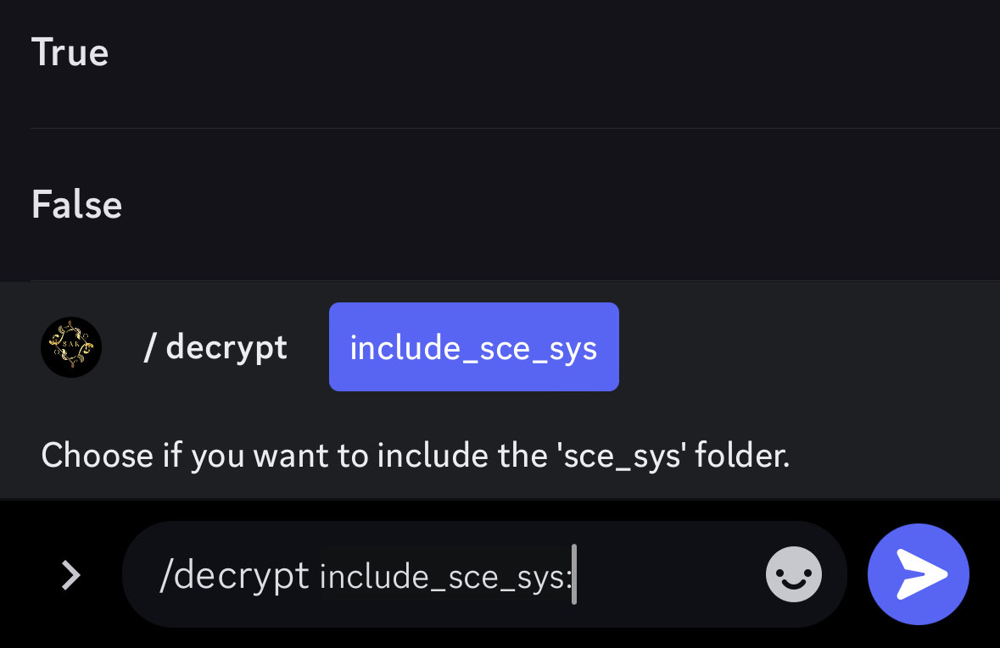
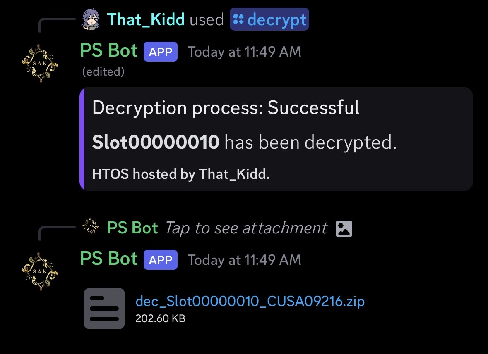

# How to Decrypt using HTOS
1. Start by typing `/decrypt` This will give you an option to include `sce_sys` or not.

2. Upload the .bin(s) and file(s) to the bot via discord (or google drive)

3. Wait for the bot to do it's thing, and send our decrypted files back.

