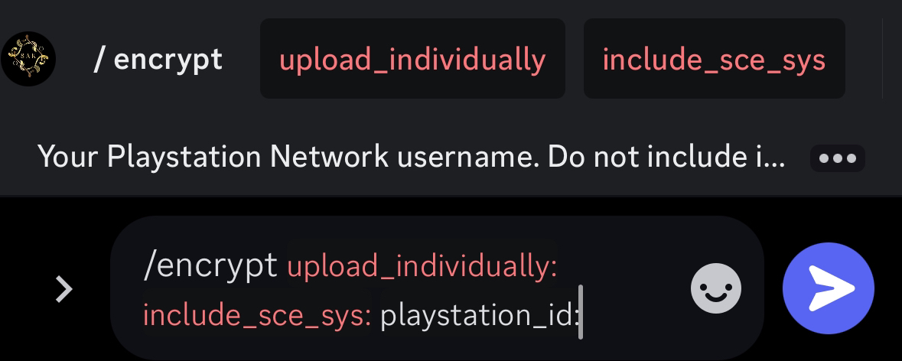
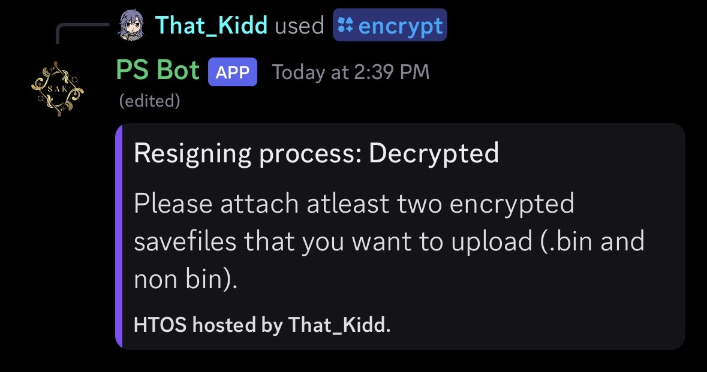
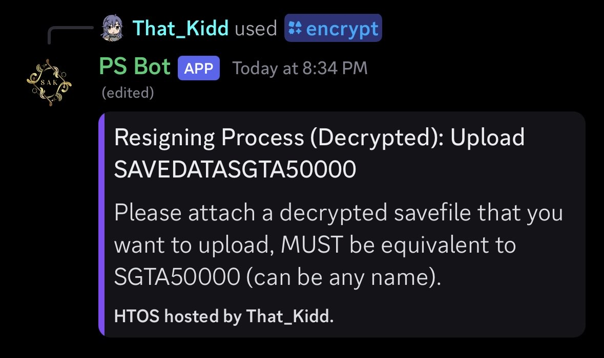
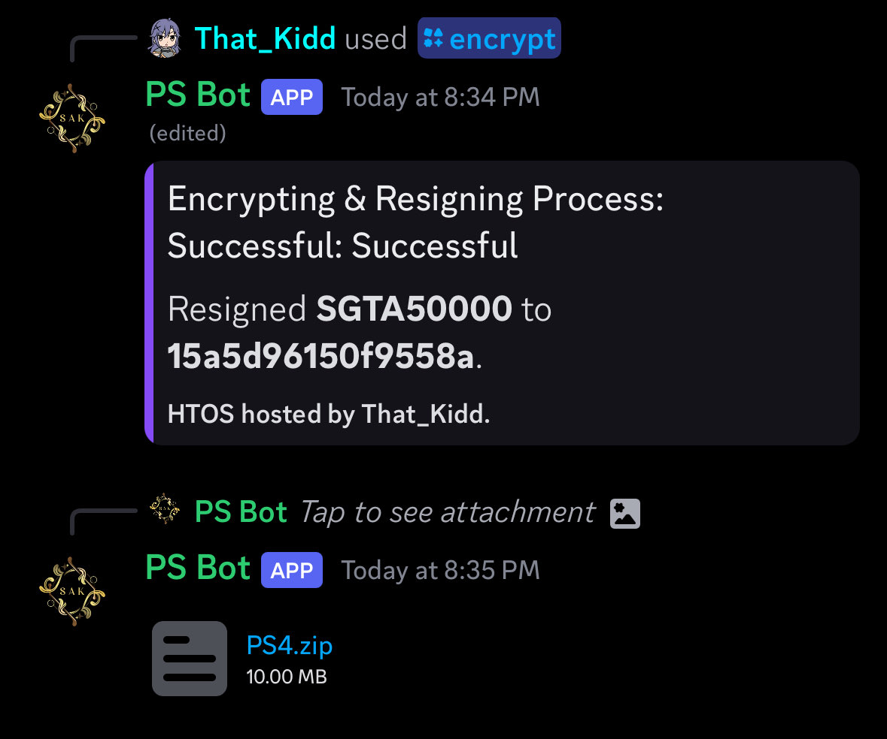

# How to Encrypt saves using HTOS


1. Start the command with ‘/encrypt’ it will give you a few different options such as upload individually, upload sce_sys, and account id. 

```
Upload individually: upload file by file when asked or all at once 
Sce_sys upload:      include sce_sys when encrypting
Account id:        who you want the save signed to after encryption. 
```



2. Upload a ps4 save file first, bin and file. 



3. After that Supply the decrypted files you want to encrypt



4. Let the bot do its thing and download the newly encrypted save. 



<sub>If you did not resign your save during the encryption process, you will have to resign it to your account afterwards.</sub>