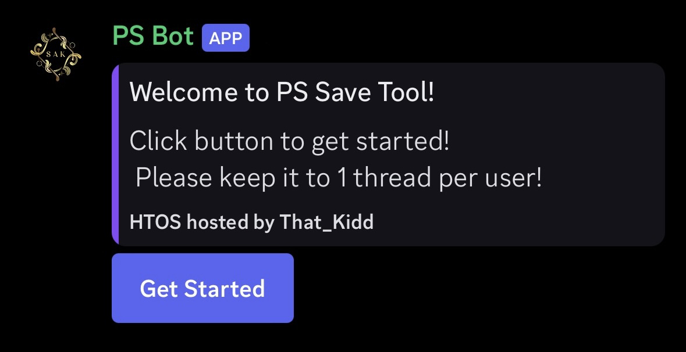
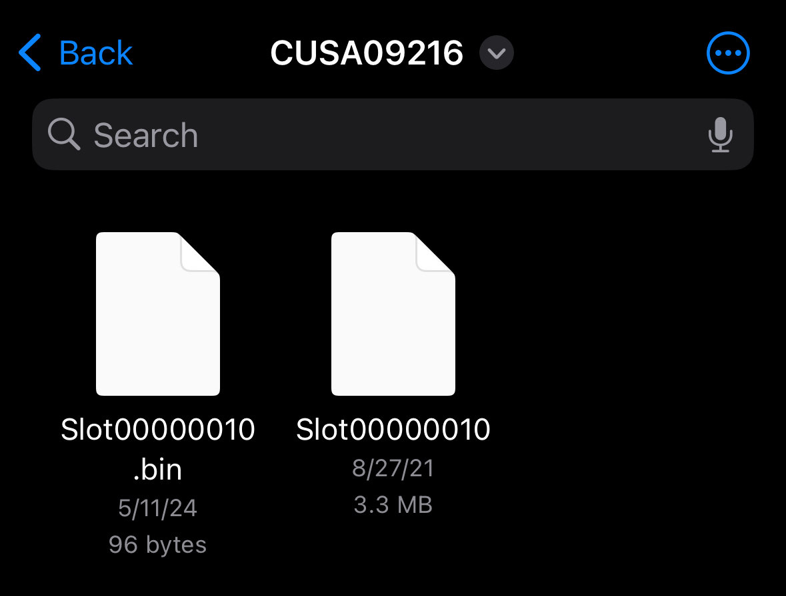

# HTOS Tutorials
Guides on how to use htos based discord bots. 

## Important Information 

To get started and using the bot you need to find this message:

Clicking the button will make a thread, which the bot will ping you in. This is where you will use commands.

### Save Files

Most PS4 saves will contain a .bin and a file, they can contain mutiple of each but for each .bin is file 
### PSN Username and Account Ids

Your account id is a number that tells the console who owns the save file. The bot is setup to take account ids.
If you do not know your account id, you can input your psn username instead and the bot will find it out for you! 

### Command Usage
Most commands you will use will be invoked by a `/` ie slash. Example: `/resign` or `/encrypt`

## Servers Hosting HTOS
1. [Main HTOS Server](https://discord.gg/kmjayh3ePG)
2. [PS Bot Server](https://discord.gg/dyapjAPdCT)
3. [Kidd's Nexus](https://discord.gg/kiddsnexus)