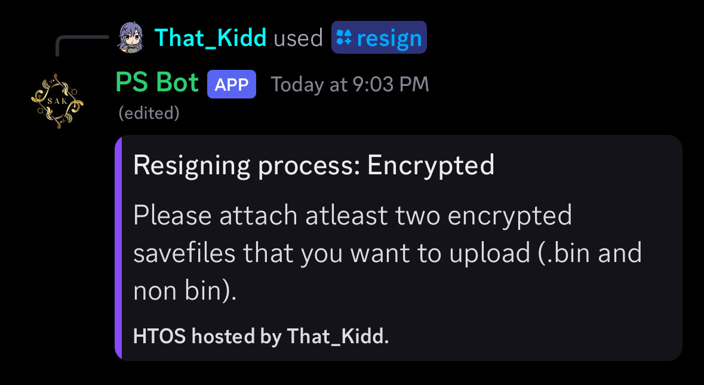
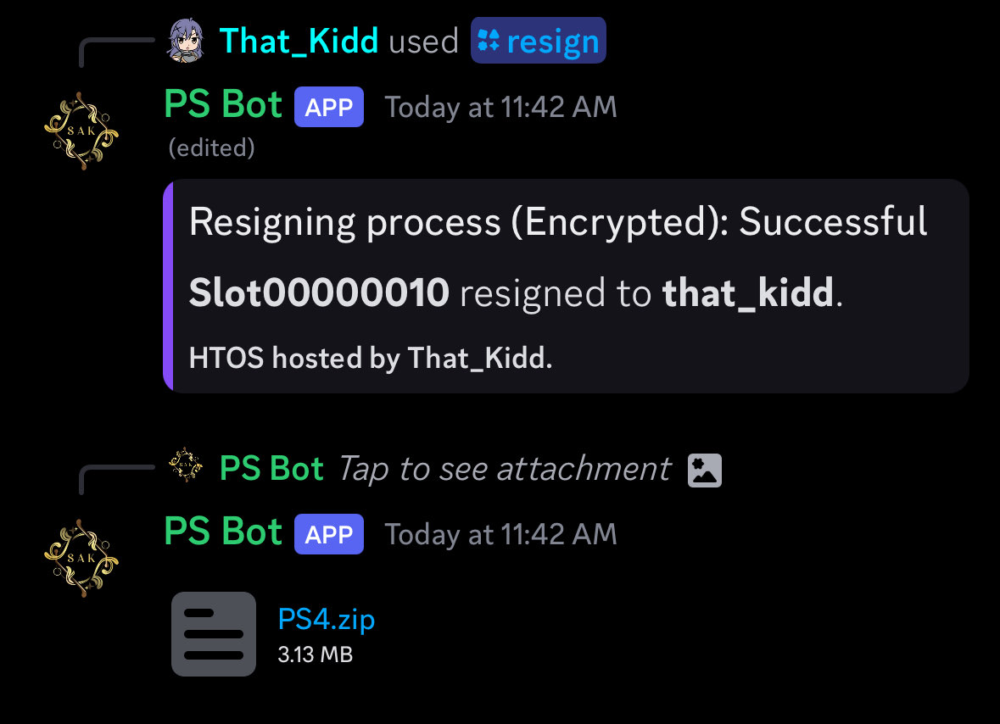

# How to Resign Using HTOS
 Guide on resinging saves using [HTOS Discord Bot](https://github.com/hzhreal/HTOS) 

1. Type `/resign` and put your psn username

2. Upload the .bin(s) and file(s) to the bot via discord 

 Google drive uploads work. Upload the files to a folder on google drive and share the folder!

3. Wait for the bot do it's thing and download the save!
