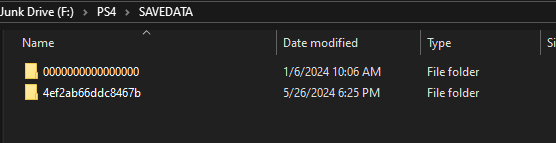

# How to get the account ID
 This will show you how to get your Account ID from your PSN Account to use to offline activate a profile on your JB PS4. 

1. On your PS4 go to `Settings` > `Application Saved Data Management`> `Saved Data in System Storage` > `Copy to USB Storage Device` and copy and save game data to your usb device

    - You can copy any save game data to create the folders you need. Do note grab a full save and not just `Profile` or `Settings`
    
2. Plug your USB into your computer. On the root of your USB you should see a folder called `PS4`. Open this folder

3. Now you should see a `SAVEDATA` folder, you need to open this folder as well.

4. You should see a folder named `XXXXXXXXXXXXXXXX` 16-digit long. This is the account id. 
    - `4ef2ab66ddc8467b` is an example of an account id.
  

`2ec30469d34ff737` is the Account ID pictured

