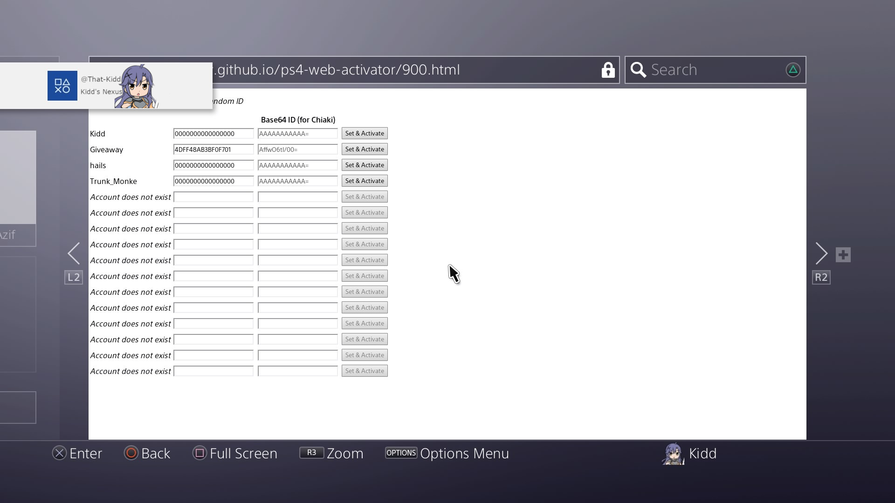

# How to offline activate a PSN account on a jailbroken ps4 (1 Method)
 This guide is written using a JB PS4 on 9.00. All links will be at the [bottom](https://github.com/That-Kidd/ps-resources/blob/main/PS4/Resign/README.md#links) or [check here](https://github.com/That-Kidd/ps-resources/tree/main/PS4/Links#links) for a list of homebrew and tools.

## Method 1. Offline account activate 
  1. Jailbreak your system
  2. Open your browser and head to `https://sleirsgoevy.github.io/ps4-web-activator/900.html`
      - Each profile has an id. The default id is `0000000000000000`. 
      
      
      
  3. Input the ID you want to set it too, and click set and activate. Close the browser restart your PS4 to force the ID to save.
      - [How to get your Account ID](https://github.com/That-Kidd/ps-resources/blob/main/PS4/Account%20ID/README.md#how-to-get-the-account-id)

 ***Congrats you have successfully activated your offline profile with your psn.***
 

[PS4 Offline Account Activator](https://github.com/charlyzard/PS4OfflineAccountActivator)

[PS4 Offline Account Activator Web](https://sleirsgoevy.github.io/ps4-web-activator/900.html)

