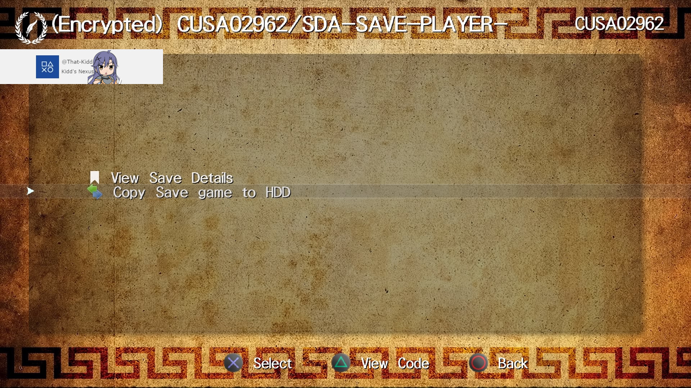
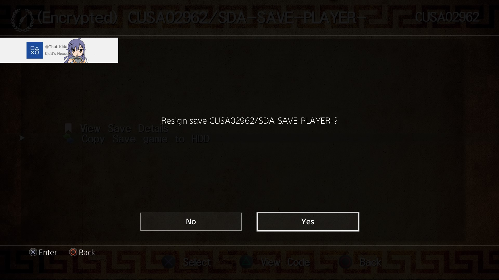

# How to resign saves using a jailbroken ps4 (1 Method)
 This guide is written using a JB PS4 on 9.00. All links will be at the [bottom](https://github.com/That-Kidd/ps-resources/blob/main/PS4/Resign/README.md#links) or [check here](https://github.com/That-Kidd/ps-resources/tree/main/PS4/Links#links) for a list of homebrew and tools.

## Method 1. Apollo save tool
  **You need to have Apollo save tool installed!**
  1. Jailbreak your system
  2. Offline activate your profile with your psn. You can follow this [guide](https://github.com/That-Kidd/ps-resources/blob/main/PS4/Offline%20Activate%20PSN%20account/README.md).
  4. Put the save on your usb in `PS4/SAVEDATA/0000000000000000/` and open Apollo. Click `USB Saves`.
  5. Find the save and click copy to HDD and click yes to resign.
     
     
     

 ***Congrats you have successfully resigned a save file***
 

 ### Links
[Apollo Save Tool](https://github.com/bucanero/apollo-ps4/releases/tag/v1.2.0)

[PS4 Offline Account Activator](https://github.com/charlyzard/PS4OfflineAccountActivator)

[PS4 Offline Account Activator Web](https://sleirsgoevy.github.io/ps4-web-activator/900.html)

